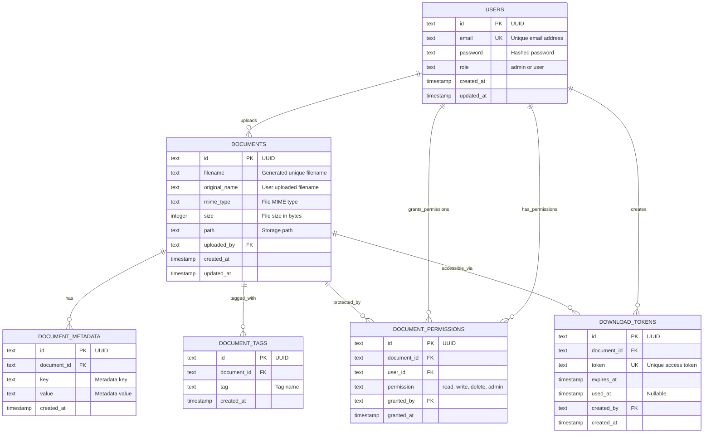

# Headless Document Management System

Headless Document Management API built with TypeScript, Bun, Hono, Drizzle and using clean architecture principles.

## Table of Contents

- [Overview](#overview)
- [Features](#features)
- [Technology Stack](#technology-stack)
- [Quick Start](#quick-start)
- [Architecture](#architecture)
- [Database Schema](#database-schema)
- [Security](#security)

## Overview

The Headless Document Management System is a backend API that demonstrates **clean architecture**, **domain-driven design**, and **modern TypeScript development** practices. It showcases production patterns for building scalable, maintainable, and secure backend systems.

## Features

### Authentication & Authorization

- JWT-based stateless authentication
- Role-based access control (Admin/User)
- Secure password hashing with bcryptjs
- Protected routes with middleware

### Document Management

- Secure file upload with validation
- UUID-based file naming for security
- Multiple file format support
- Metadata and tagging system
- Full-text search capabilities

### Permission System

- Granular document permissions (read/write/delete/admin)
- User-to-user permission sharing
- Permission inheritance and management
- Audit trail for permission changes

### Secure Access

- Temporary download links with expiration
- Token-based secure file access
- Automatic cleanup of expired tokens
- Direct download protection

### Enterprise Architecture

- Clean architecture with separation of concerns
- Repository pattern for data access
- Service layer for business logic
- Type-safe development with TypeScript
- Comprehensive input validation

## Technology Stack

| Category           | Technology                                        | Purpose                                      |
| ------------------ | ------------------------------------------------- | -------------------------------------------- |
| **Runtime**        | [Bun](https://bun.sh/)                            | Fast JavaScript runtime with built-in SQLite |
| **HTTP Framework** | [Hono](https://hono.dev/)                         | Lightweight, fast web framework              |
| **Database**       | SQLite + [Drizzle ORM](https://orm.drizzle.team/) | Type-safe database operations                |
| **Authentication** | JWT + bcryptjs                                    | Secure token-based authentication            |
| **Validation**     | [Zod](https://zod.dev/)                           | TypeScript-first schema validation           |
| **File Storage**   | Local filesystem                                  | UUID-based file storage                      |
| **Development**    | TypeScript                                        | Type-safe development                        |

## Quick Start

### Prerequisites

- [Bun](https://bun.sh/) 1.0+ installed
- Node.js compatible environment

### Installation

1. **Clone the repository**

   ```bash
   git clone <repository-url>
   cd hdm
   ```

2. **Install dependencies**

   ```bash
   bun install
   ```

3. **Initialize database**

   ```bash
   # Create data directory
   mkdir -p data

   # Generate migration files
   bun run db:generate

   # Apply migrations
   bun run db:push
   ```

4. **Start development server**
   ```bash
   bun run dev
   # Server starts on http://localhost:3000
   ```

### Environment Configuration

Create a `.env` file with the following variables:

```env
# Server Configuration
PORT=3000
NODE_ENV=development

# Database
DATABASE_URL=sqlite:./data/hdm.db

# JWT Configuration (CHANGE IN PRODUCTION!)
JWT_SECRET=your-super-secret-jwt-key-change-this-in-production-make-it-very-long
JWT_EXPIRES_IN=7d

# File Upload Configuration
UPLOAD_MAX_SIZE=10485760  # 10MB in bytes
UPLOAD_DIR=./uploads

# Download Links
DOWNLOAD_LINK_EXPIRES_IN=1h
```

### Quick Test

```bash
# Health check
curl http://localhost:3000/health

# Register a user
curl -X POST http://localhost:3000/api/v1/auth/register \
  -H "Content-Type: application/json" \
  -d '{"email": "admin@example.com", "password": "password123", "role": "admin"}'

# Login and get JWT token
curl -X POST http://localhost:3000/api/v1/auth/login \
  -H "Content-Type: application/json" \
  -d '{"email": "admin@example.com", "password": "password123"}'
```

## Architecture

### Layer Structure

```
src/
├── controllers/        # HTTP request handlers
│   ├── AuthController.ts
│   ├── DocumentController.ts
│   ├── MetadataPermissionController.ts
│   └── DownloadLinkController.ts
├── services/          # Business logic layer
│   ├── AuthService.ts
│   ├── DocumentService.ts
│   ├── MetadataPermissionService.ts
│   └── DownloadLinkService.ts
├── repositories/      # Data access layer
│   ├── UserRepository.ts
│   ├── DocumentRepository.ts
│   ├── DocumentMetadataRepository.ts
│   ├── DocumentPermissionRepository.ts
│   ├── DocumentTagRepository.ts
│   └── DownloadTokenRepository.ts
├── models/           # Database schema and connection
│   ├── schema.ts
│   └── database.ts
├── types/            # TypeScript interfaces and DTOs
│   ├── domain.ts
│   ├── dto.ts
│   └── repositories.ts
├── middleware/       # Authentication and authorization
│   └── auth.ts
├── utils/           # Helper functions and utilities
│   └── fileUpload.ts
├── config/          # Environment configuration
│   └── env.ts
└── index.ts         # Application entry point
```

### Design Principles

- **Clean Architecture**: Clear separation between HTTP, business logic, and data layers
- **Repository Pattern**: Interface based data access for easy testing and swapping
- **Service Layer**: Business logic abstraction from HTTP concerns
- **Dependency Injection**: Loose coupling through constructor injection
- **Type Safety**: Comprehensive TypeScript with strict mode enabled
- **Input Validation**: Zod schemas for all API endpoints

### Base URL

```
http://localhost:3000/api/v1
```

### Authentication

All protected endpoints require a Bearer token in the Authorization header:

```
Authorization: Bearer <jwt-token>
```

### Endpoints Overview

#### Authentication

| Method | Endpoint         | Description       | Auth Required |
| ------ | ---------------- | ----------------- | ------------- |
| `POST` | `/auth/register` | User registration | ❌            |
| `POST` | `/auth/login`    | User login        | ❌            |
| `GET`  | `/auth/me`       | Get current user  | ✅            |

#### Document Management

| Method   | Endpoint                  | Description          | Auth Required |
| -------- | ------------------------- | -------------------- | ------------- |
| `POST`   | `/documents`              | Upload document      | ✅            |
| `GET`    | `/documents`              | Get user documents   | ✅            |
| `GET`    | `/documents/search`       | Search documents     | ✅            |
| `GET`    | `/documents/:id`          | Get document details | ❌            |
| `GET`    | `/documents/:id/download` | Download document    | ❌            |
| `DELETE` | `/documents/:id`          | Delete document      | ✅            |

#### Metadata Management

| Method   | Endpoint                  | Description     | Auth Required |
| -------- | ------------------------- | --------------- | ------------- |
| `POST`   | `/documents/:id/metadata` | Add metadata    | ✅            |
| `GET`    | `/documents/:id/metadata` | Get metadata    | ❌            |
| `PUT`    | `/metadata/:id`           | Update metadata | ✅            |
| `DELETE` | `/metadata/:id`           | Delete metadata | ✅            |

#### Permission Management

| Method   | Endpoint                     | Description          | Auth Required |
| -------- | ---------------------------- | -------------------- | ------------- |
| `POST`   | `/documents/:id/permissions` | Grant permission     | ✅            |
| `GET`    | `/documents/:id/permissions` | Get permissions      | ❌            |
| `GET`    | `/permissions/my`            | Get user permissions | ✅            |
| `PUT`    | `/permissions/:id`           | Update permission    | ✅            |
| `DELETE` | `/permissions/:id`           | Revoke permission    | ✅            |

#### Download Links

| Method | Endpoint                       | Description            | Auth Required |
| ------ | ------------------------------ | ---------------------- | ------------- |
| `POST` | `/documents/:id/download-link` | Generate temp link     | ✅            |
| `GET`  | `/download/:token`             | Download via token     | ❌            |
| `POST` | `/admin/cleanup-tokens`        | Cleanup expired tokens | ✅ (Admin)    |

### Response Format

All API responses follow this consistent format:

**Success Response:**

```json
{
  "success": true,
  "message": "Operation completed successfully",
  "data": {
    /* response data */
  }
}
```

**Error Response:**

```json
{
  "success": false,
  "error": "Error message",
  "details": [
    /* validation errors if applicable */
  ]
}
```

**Paginated Response:**

```json
{
  "success": true,
  "data": [
    /* items */
  ],
  "pagination": {
    "page": 1,
    "limit": 20,
    "total": 100,
    "totalPages": 5
  }
}
```

## Development

### Available Scripts

```bash
# Development
bun run dev          # Start with hot reload
bun run start        # Production start
bun run build        # Build for production

# Database
bun run db:generate  # Generate migration files
bun run db:migrate   # Run migrations
bun run db:push      # Push schema to database

# Development Tools
bun run lint         # Code linting
bun run format       # Code formatting
bun run type-check   # TypeScript checking
```

## Database Schema

### Entity Relationship Diagram



### Database Features

- **UUID Primary Keys**: All entities use UUID v4 for security
- **Foreign Key Constraints**: Proper relationships with cascade deletes
- **Indexes**: Optimized queries on email, tokens, and search fields
- **Timestamps**: Automatic creation and update tracking
- **Data Integrity**: NOT NULL constraints and type validations

## Security

### Authentication & Authorization

- **JWT Tokens**: Stateless authentication with configurable expiration
- **Password Security**: bcryptjs hashing with 12 salt rounds
- **Role-Based Access**: Admin and User roles with different permissions
- **Resource Protection**: Middleware-based route protection

### Data Security

- **Input Validation**: Comprehensive Zod schema validation
- **SQL Injection Protection**: Parameterized queries via Drizzle ORM
- **UUID Primary Keys**: Non sequential IDs prevent enumeration attacks
- **File Security**: UUID based filenames prevent direct access

### API Security

- **CORS Configuration**: Cross origin request handling
- **Error Handling**: Secure error messages without information leakage
- **Request Validation**: Content type and authorization header validation
